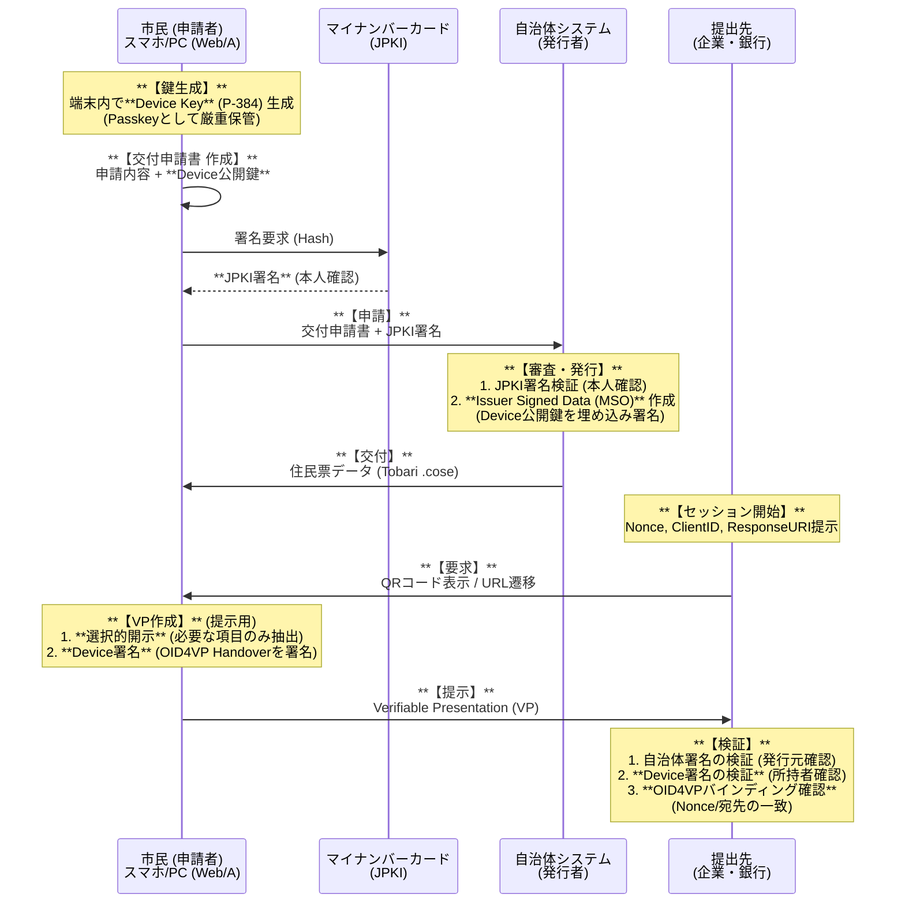

**中間報告書における指摘事項（真正性・転々流通防止等）に対する技術的回答**

## 1. はじめに（検証の目的と位置付け）

本報告書は、検討会中間報告書等において提示された、「住民票の写し」等の電子交付に求められる高度な要件（真正性の担保、転々流通の防止、外字の正確な表示等）について、既存技術の組み合わせによりどこまで実現可能かを検証した技術報告である。

特に、先行して行われた検討会中間報告書等において指摘された**「転々流通（不正な使い回し）の防止」「真正性の担保」「外字の正確な表示」**といった課題に対し、Web標準技術（HTML/CSS）と最新の国際デジタルID標準（ISO 18013-5 mDoc / IETF SD-JWT）を融合させることで、いかに解決可能かを実証・検証した結果を示すものである。

### 検証の成果概要
我々の技術検証により、以下の成果が得られた。
1.  **技術的成立性**: 項目単位の選択的開示（Selective Disclosure）を実装しても、閲覧・検証機能を内包して**250KB〜290KB程度の現実的なファイルサイズ**（Gzipped時）に収まることを実証。
2.  **高度なセキュリティ（Binding）**: オフライン署名検証に加え、**Holder Binding**や**Device Binding**により、真正性担保と不正利用防止（所持者確認）を両立可能であることを確認。
3.  **氏名等の漢字の再現性**: **IVS（異体字セレクタ）対応のサブセットフォント**埋め込み技術により、行政事務標準文字を環境非依存かつ省サイズで表示可能であることを確認。

---

## 2. 背景と検討課題

### 2.1. 既存方式（紙・PDF）の限界

#### (1) 紙媒体による交付

現在広く利用されている紙の「住民票の写し」には、物理媒体ゆえの限界が存在する。
*   **機械検証の困難さ**: 偽造防止用紙や公印の確認は目視に依存しており、オンラインでの真正性確認やシステムによる自動検証が困難である。

*   **機械可読性の欠如**: データとして再利用（入力自動化等）ができず、OCR等の処理が必要となる。特に氏名や住所に含まれる異体字・外字を正確に認識することは技術的に困難である。

*   **デジタル完結の阻害**: オンライン申請であっても、原本性を証明するために「紙の郵送」が必要となるケースが多く、完全なデジタル完結が困難である。

#### (2) 署名付きPDFによる電子交付の課題

納税証明書等で先行して導入されているPDFを用いた電子交付モデルを住民票に適用しようとした場合、以下の技術的課題が懸念される。

*   **特定ソフトウェアへの依存**: 電子署名の有効性を検証するには、Adobe Acrobat Reader等の特定のプロプライエタリ・ソフトウェアに依存する場合が多い。これは、公的インフラが特定企業の製品方針やサポート状況に左右されるリスク（ベンダーロックイン）を意味する。

*   **機械可読性の欠如**: PDFは表示の再現性を重視したフォーマットであり、構造化データとしての抽出・活用が困難である。特に外字が含まれる場合、文字コードとしての情報が失われていることが多く、データ連携の障害となる。

*   **過剰な情報開示と選択的開示の不可能性**: 紙と同様、提出先に不要な情報が含まれやすい。また、利用者が事後的に「黒塗り」加工を行うと、ファイル改変により**電子署名が無効化**されるため、必要な情報だけを選んで提示する「選択的開示（Selective Disclosure）」は構造的に不可能である。
    （※見た目だけの黒塗りではデータが残存し、情報漏洩のリスクがある）

*   **運用の形骸化**: 検証環境が受信者側に整っていない場合、結局は「印刷して紙として扱う」という運用に回帰しがちであり、電子化のメリット（真正性の担保）が失われる。

### 2.2. Verifiable Credentials (VC) 早期導入のハードル
中間報告書等でも言及されている Verifiable Credentials (VC) やモバイル運転免許証（mDL / ISO 18013-5）といった次世代ID規格は、将来的には有望な解決策である。しかし、現時点で「住民票の写し」の電子交付基盤として直ちに採用するには、以下のハードルが存在する。

*   **相互運用性（Interoperability）の欠如**: Walletアプリや検証器（Verifier）の仕様は各社・各国で統一されておらず、特定のWalletに入れた証明書が他所では使えない「サイロ化」のリスクが高い。

*   **プラットフォーム事業者への依存**: OS標準のWallet（Apple Wallet / Google Wallet等）での取り扱いは、プラットフォーム事業者による個別対応や審査を待つ必要があり、導入時期や仕様の決定権を行政側が持てない。

*   **外字表示の壁**: 現在の標準的なVC仕様には、氏名・住所に含まれる本邦固有の「外字（行政事務標準文字）」を、受領者の環境に依存せず正確に表示・検証するための仕組みが含まれていない。

### 2.3. 「自己完結型（Self-Contained）」という現実解への到達

このように国際標準の実装や相互運用性の確立を待っていては、住民サービスのデジタル化は停滞せざるを得ない。そこで本報告書では、標準化の進展やプラットフォーム主導の実装を待つことなく、「住民票の写しなどの電子交付」に求められる要件（真正性・視読性・ポータビリティ）を満たすための現実解を模索した。

その結果、Walletの相互運用性が未確立である現状に対する、ある種「苦肉の策」ではあるものの、検証に必要なロジックと表示機能（UI）をデータそのものに内包させる**「自己完結型・検証可能ビューアー（Self-Contained Verifiable Viewer）」**というアプローチにより、既存のWeb標準技術の組み合わせによって、直ちにセキュアな電子交付が実現可能であるとの結論に至った。

また、本検証を通じて「Webベースで動作する住民票VC」の具体的な技術仕様を早期に示すことは、単なる一時しのぎではない重要な意義を持つ。日本固有の要件（外字の正確な表示や厳格なレイアウト再現等）を実装可能な形で世界に示すことで、現在進行中の国際標準化プロセス（ISO/IETF/W3C等）に対して、日本からの要件をフィードバックし、標準仕様そのものに影響を与えていく（我々の要件を反映させる）ための布石ともなるものである。

---

## 3. 検証対象技術モデル

本検証では、以下の「Universal Juminhyo Viewer」モデルを採用し、プロトタイプの実装を行った。

### 3.1. コンセプト: "Universal Juminhyo Viewer"
**「見た目はいつもの住民票、中身は最新のデジタル証明書」**
専用アプリを不要とし、PCやスマホの標準ブラウザだけで閲覧・検証・提出データ生成が可能なHTMLファイルを交付媒体とする。

### 3.2. 技術的構成要素（実装済みプロトタイプ）
検証において作成した単一 `.html` ファイルは、以下の要素をすべて内包する（Self-Contained）。

| レイヤー | 技術規格 | 役割 | 検証結果 |
| :--- | :--- | :--- | :--- |
| **UX/表示層** | **HTML5 + CSS + WOFF2** | 人間用表示 | **IVS（異体字セレクタ）**に対応した書記素（Grapheme）単位のサブセット抽出により、**外字を含む行政事務標準文字の完全再現**に成功。 |
| **データ層1** | **ISO 18013-5 mDoc** | 機械用原本 | モバイル運転免許証互換のバイナリ規格（CBOR）。改ざん検知を確認。 |
| **データ層2** | **IETF SD-JWT** | 機械用原本 | Web親和性の高いJSON形式。システム連携の容易さを確認。 |
| **配布形式** | **Isolated Web Apps (IWA)** | 自己完結実行 | 署名済みWeb Bundle (.swbn) 形式により、**完全にオフラインの状態でのパスキー復号**に成功。 |
| **検証ロジック** | **Client-Side JS (WASM)** | 署名検証 | ブラウザ上で署名を検証し、**真正性が確認された場合のみ証明書を表示**する制御に成功。 |

### 3.3. 検証結果：選択的開示とプライバシー保護の高度化
mDoc/SD-JWTの特性を活かし、プライバシーおよび名寄せリスクを最小化する以下の機能が実装可能であることを確認した。

#### (1) 識別子の隠蔽による名寄せ防止
氏名や住所は開示しつつ、**「個人番号（マイナンバー）」や「住民票コード」といった一意の識別子（ユニークID）のみをマスキング（非開示）**して提出することが可能である。
これにより、提出先企業が複数のデータを突合して個人の行動をプロファイリング（名寄せ）するリスクを、技術的に遮断できる。

#### (2) 発行者による追跡防止 (No Phone-home)
本方式は、検証に必要な情報（公開鍵や失効リスト等）をあらかじめ配布・キャッシュ可能なため、**検証時に発行者（自治体サーバー）へのオンライン問い合わせが不要**である。
これにより、API連携型システムで懸念される「いつ、誰が、どこに証明書を提出したか」という個人の行動履歴を、行政側が監視・収集することが構造的に不可能な設計（Privacy by Design）となっている。

#### (3) 究極の自己完結：Isolated Web Apps (IWA) による完全ローカル実行
本検証では、Google等が推進する最新規格 **Isolated Web Apps (IWA)** を採用した PoC を実装した。
従来の Web アプリは常にサーバーとの通信を前提とするが、IWA では署名済みのバイナリ（Signed Web Bundle）をブラウザにインストールすることで、`isolated-app://` という独自のセキュアなオリジンが割り当てられる。
これにより、**「インターネットから物理的に切断されたオフライン状態」であっても、生体認証（パスキー）を用いた証明書の復号・閲覧が完全にローカルで完結する**ことを実証した。これは、デジタル証明書が「発行者のサーバー」から完全に独立し、利用者の手元で「デジタルの紙」として機能することを意味する。

#### (4) フォント情報からの情報漏洩防止（Side-channel protection）
フォントのサブセット化（使用されている文字のみを抽出してファイルサイズを削減する技術）において、**暗号化されたドキュメントについてはサブセット化をあえて行わない**設計を採用した。
これは、サブセット化されたフォント内に含まれる文字のリストを分析することで、暗号化された内容（例：氏名の構成文字）が推測されるサイドチャネル攻撃のリスクを排除するためである。

#### (4) フラット化データ構造の有効性
ネスト構造を排除したフラット化キー（例: `member_0_name`）の採用により、実装の複雑さを排除しつつ、項目単位での柔軟なマスキング処理が、ブラウザ上の軽量な処理のみで完結できることを確認した。

#### (5) WebAssemblyによる高速な署名検証とJPKI通信
署名検証ロジック（Ed25519/P-256/ML-DSA）および**公的個人認証（JPKI）との通信制御（APDUコマンド生成・解析）をRust/WebAssembly (WASM) として実装**。これにより、ネイティブアプリ（exe/dmg等）を一切インストールすることなく、ブラウザとICカードリーダーだけで、マイナンバーカードによる本人確認と、高速な暗号検証処理が完結することを確認した。

---

## 4. 中間報告書への回答：転々流通防止と認証モデル

中間報告書等で最大の懸念点として挙げられている**「電子データの転々流通（本人以外へのデータ流出と不正利用）」**に対し、本検証では**「申請・交付プロセスへの鍵紐付け（Key Binding）」**による解決策を設計・提示する。

### 4.1. 提案モデル：Device Key (Passkey) とJPKIを組み合わせた「交付申請・受理モデル」
行政手続きの既存形式（申請書と受理証）と暗号技術を組み合わせ、**「そのデータ（住民票）を使う権利」**まで含めて暗号的に紐付ける。技術仕様としては **ISO 18013-5 (mdoc) の Device Authenticaion** および **ISO 18013-7 (OID4VP)** を採用する。

#### データ流通フローと防衛策



### 4.2. なぜ「コピー」による不正利用を防げるのか
このモデルでは、単に住民票データ（HTMLファイルやCOSEバイナリ）をコピーしただけでは、提出先での検証および業務利用が不可能となる。

| コンポーネント | 役割と転々流通防止効果 |
| :--- | :--- |
| **Device Key (Passkey)** | **「所有の証明 (Proof of Possession)」**。<br/>発行時に登録されたデバイス鍵（秘密鍵）は、端末のセキュア領域（SE/TPM）から外に出ない。第三者が住民票データをコピーしても、この秘密鍵を持たないため有効なVP（提示データ）を作成できず、検証段階で拒否される。 |
| **Issuer Signed MSO**<br/>(Mobile Security Object) | **「鍵の公的認証 (Key Authorization)」**。<br/>自治体は、住民票のメタデータ（MSO）の中に「この住民票の正当な持ち主の鍵はこれである」という情報を埋め込んで署名する。これにより、勝手に別の鍵を使って署名することを防ぐ。 |
| **OID4VP Session Handover**<br/>(ISO 18013-7) | **「フィッシング耐性 (Phishing Resistance)」**。<br/>提示時に署名するデータには、単なる乱数(Nonce)だけでなく、提出先のIDやURL（Client ID / Response URI）のハッシュが含まれる。これにより、正規のサイトのふりをした攻撃者にVPを渡しても、そのVPは攻撃者のサイト（異なるURL）では無効となるため、中間者攻撃を防ぐことができる。 |

### 4.3. 透明性の確保（CLI検証ツール）
本方式は特定のベンダー製品に依存しないオープンな仕様（ISO/IETF準拠）である。
検証の透明性を担保するため、ソースコードおよび**CLI検証ツール（verify-cli）**をOSSとして公開し、誰でもバイナリレベルでの真正性検証が可能である状態を維持する。

> **検証コマンド例**: `bun run verify:cli juminhyo-vp.cose`

---


## 5. 社会実装に向けた論点整理

本技術検証により、電子交付における主要な技術課題（真正性・転々流通防止・外字表示）は解決可能であることが示された。一方で、実際の制度運用および社会実装に向けては、技術選定と並行して以下の点について整理が必要であると考えられる。

1.  **住民基本台帳法上の法適合性**
    *   本方式が提供する「電子署名」および「改ざん検知機能」が、現行の住民基本台帳法（特に第12条の写しの交付等）が求める真正性の要件を法的に充足するかどうかの解釈整理。

2.  **選択的開示（Selective Disclosure）の適用範囲とデータサイズのトレードオフ**
    *   **データサイズの内訳**: 本方式の成果物（HTML）は約200KBであるが、その大半は「ビューアー機能（検証ロジック・フォント・UI）」が占めており、証明データそのもののサイズは極めて小さい。
        *   **ビューアー部**: 約280KB（mDoc/SD-JWT検証機能、外字フォント含む）※圧縮時
        *   **証明データ部**: **約6KB〜9KB**（標準的な4人世帯のモデルケースにおける実測値）
    *   **粒度とオーバーヘッド**: 選択可能な項目を細分化するとハッシュやソルトが増加するが、PoCコードによる実測では以下の通り大きな差は生じなかった。
        *   **全項目選択可能（最大粒度）**: 約8.3KB
        *   **標準的な選択肢（世帯単位＋秘匿項目独立）**: 約5.9KB
    *   **結論**: 項目を極限までバラバラに選択可能としても、増加量は2.4KB程度であり、ファイル全体のサイズ（約200KB）に対しては誤差の範囲である。したがって、データサイズを懸念して選択肢を制限する必要はなく、**「利用者の利便性とプライバシー」を最優先に、可能な限り柔軟な選択的開示を許容すべき**である。

3.  **認証方式の技術的中立性**
    *   本検証ではKey Bindingの手段としてFIDO/Passkeyを用いたが、制度設計においては特定の技術に限定せず、公的個人認証（JPKI）や他の当人認証手段も含めた技術的中立的な評価・選定が必要である点。

4.  **自治体システム標準仕様書との整合**
    *   「自治体システム標準仕様書」において、本方式（HTML+mDoc/SD-JWT形式での証明書データ交付）をデータ要件・連携要件としてどのように位置付けるかについての整理。

5.  **複数証明書の紐付けにおける識別子ハンドリング**
    *   本検証では、マイナンバーや証明書シリアルナンバー等の法定識別子に依存せずとも、暗号学的に複数の証明書を紐付ける（Binding）ことが技術的に可能であることを確認した。
    *   これを踏まえ、プライバシー保護の観点から**「どこまでUnlinkability（非連結性）を求めるか」**、およびその実現のために用いられる一時的な識別子について、**「法的な定義（法定識別子化）が必要か、あるいはプライバシー侵害リスクが低く特段の規律を要さない一時的なトークンとして法定不要と整理できるか」**という点について、さらなる整理が必要である。

6.  **視覚的検証モデルとUXの在り方**

    *   **紙様式の模倣 vs デジタル最適化**: 従来の「紙の住民票」のレイアウトを画面上で再現すること（Fixed Layout）は、既存業務との親和性が高い。本検証では、CSSによる「二重枠」や「印影（hankyo）」の再現、世帯員情報のテーブル構造の動的生成により、ブラウザ上での高度な視読性を実証した。
    
    *   **ブラウザのセキュリティ制約（Secure Context）への対応**: 
        Passkey（WebAuthn）による復号にはセキュアなコンテキスト（HTTPS等）が必須となるが、ローカルの `file://` プロトコルではこの機能が制限される。
        本検証では、ローカルファイルを開いた際に、自動的に信頼された「セキュア・ゲートウェイ・ビューアー」へリダイレクトする仕組みを実装した。この際、**証明書データはURLのフラグメント（#）を通じてのみ渡され、サーバー側には一切送信されない**ため、ブラウザのセキュリティ要件を満たしつつプライバシーを保護できる。

    *   **意図的なデザインの差別化**: 電子交付されたファイルを「印刷して使用するもの」と誤認したり、紙の偽造（コピー）と混同されたりするリスクを防ぐため、**あえて紙とは全く異なるレスポンシブなデザインを採用することも考えられる**。本検証のビューアーはレスポンシブWebデザインに対応しており、スマートフォンの縦長画面でも世帯員情報が最適に配置されることを確認した。

7.  **手数料徴収（課金）モデルの再検討**

    *   **発行時課金 vs 利用時課金**: 現行の住民票は「発行時」に手数料を徴収しているが、電子データとして手元に常備できる本方式においては、課金ポイントの再考が可能である。

    *   **新たなモデルの検討**: 例えば、発行自体は安価または無料とし、提出用データ（VP: Verifiable Presentation）を生成する際や、提出先（Verifier）が有効性確認を行う際に課金するモデルなどが考えられる。これにより、「とりあえず手元に持っておく」ことを促進し、社会全体のデジタル化コストを最適化する議論が求められる。

---

## 6. 結論

本技術検証により、HTML/CSSと最新の暗号技術規格（mDoc/SD-JWT）を組み合わせることで、中間報告書等で指摘された「真正性の担保」「転々流通防止」「外字表示」といった課題を解決し得る電子交付モデルが、技術的には実装可能であることが確認された。

特に、特定ベンダーのプロプライエタリな製品に依存せず、オープンなWeb標準技術のみで構成できることは、持続可能な公的インフラを設計する上で重要な示唆を与えるものである。

今後は本検証で得られた技術的知見を基礎として、実際の法制度や運用、標準仕様への適合性についてのより具体的な検討が進められることが期待される。

---

## 付録: データサイズ計測詳細報告

本検証において、選択的開示の粒度がデータサイズに与える影響を定量的に評価するため、実際の運用を想定した日本語データ（外字・IVS含む）を用いて実測を行った。

### 1. 計測条件
*   **対象データ**: 標準的な4人世帯（世帯主＋子3人）を想定した住民票データ（`tobari`プロジェクトのモデルデータに準拠）
*   **署名方式**: Hybrid Signature (Ed25519 + ML-DSA-44) ※耐量子暗号を含む
*   **計測対象**: SD-JWT/COSE形式の電子署名済みデータ（ビューアーアプリを含まない、純粋な証明書データ部分）

### 2. 使用したモデルデータ（4人世帯・日本語）
IVS（異体字セレクタ）を含む氏名や、実際の運用に近いデータ長の日本語文字列を使用。

```json
[
    {
        "name": "䶒藤󠄃 太朗󠄅",
        "kana": "サイトウ タロウ",
        "dob": "1989-01-01",
        "gender": "男",
        "relation": "世帯主",
        "residentDate": "2019-12-04",
        "residentReason": "転入",
        "addressDate": "2019-12-04",
        "notificationDate": "2019-12-01",
        "prevAddress": "東京都千代田区霞が関2丁目2番1号",
        "honseki": [
            "東京都千代田区千代田1-1",
            "筆頭者：䶒藤󠄃 太朗󠄅"
        ],
        "myNumber": "379474484458",
        "code": "24727059608",
        "remarks": [
            "自動交付機利用者"
        ]
    },
    {
        "name": "䶒藤󠄃 花󠄃子",
        "kana": "サイトウ ハナコ",
        "dob": "1993-05-05",
        "gender": "女",
        "relation": "妻",
        "residentDate": "2019-12-04",
        "residentReason": "転入",
        "addressDate": "2019-12-04",
        "notificationDate": "2019-12-01",
        "prevAddress": "東京都千代田区霞が関2丁目2番1号",
        "honseki": [
            "東京都千代田区千代田1-1",
            "筆頭者：䶒藤󠄃 太朗󠄅"
        ],
        "oldName": "渡𮞽",
        "oldNameKana": "ワタナベ",
        "myNumber": "454972364860",
        "code": "24846016224"
    },
    {
        "name": "䶒藤󠄃 一朗󠄅",
        "kana": "サイトウ イチロウ",
        "dob": "2019-05-01",
        "gender": "男",
        "relation": "子",
        "residentDate": "2019-12-04",
        "residentReason": "出生",
        "addressDate": "＊＊＊",
        "notificationDate": "2019-12-01",
        "prevAddress": "東京都千代田区霞が関2丁目2番1号",
        "honseki": [
            "東京都千代田区千代田1-1",
            "筆頭者：䶒藤󠄃 太朗󠄅"
        ],
        "myNumber": "507957100721",
        "code": "25208017643"
    },
    {
        "name": "䶒藤󠄃 二朗󠄅",
        "kana": "サイトウ ジロウ",
        "dob": "2019-05-01",
        "gender": "男",
        "relation": "子",
        "residentDate": "2019-12-04",
        "residentReason": "出生",
        "addressDate": "＊＊＊",
        "notificationDate": "2019-12-01",
        "prevAddress": "東京都千代田区霞が関2丁目2番1号",
        "honseki": [
            "東京都千代田区千代田1-1",
            "筆頭者：䶒藤󠄃 太朗󠄅"
        ],
        "myNumber": "507957100722",
        "code": "25208017644"
    }
]
```

### 3. 計測シナリオとパラメータ

#### シナリオA：最大粒度（Max Granularity）
*   **設定**: 氏名、住所、生年月日等の基本情報も含め、ほぼすべての項目を個別に選択・秘匿可能とする。
*   **構造**: 世帯主氏名や世帯住所などのヘッダー情報も含め、全項目に対して個別にSalt/Hashを生成して保護。

#### シナリオB：標準グループ（Grouped Granularity）
*   **設定**: 常にセットで開示される「基本4情報＋住定日＋前住所」等はグループ化し、秘匿ニーズの高い「続柄」「本籍」「マイナンバー」「住民票コード」「備考」のみを独立して選択可能とする。
*   **構造**: 各世帯員を1つのMemberオブジェクトとして扱い、その中のセンシティブ項目のみを個別Disclosureとして分離。

### 4. 計測結果（フォーマット別比較）

| シナリオ | mDoc (CBOR) Total | SD-JWT (Hybrid Est.) Total | 備考 |
| :--- | :--- | :--- | :--- |
| **A: 最大粒度** | **8.26 KB** | **10.76 KB** | Base64URL符号化によりSD-JWTが約3割増 |
| **B: 標準グループ** | **5.85 KB** | **7.14 KB** | センシティブ項目のみ秘匿化、基本情報は平文（Base64内） |

### 5. 考察
*   **フォーマットによる差異**: バイナリ形式のmDoc (CBOR) に比べ、テキストベースのSD-JWTはBase64URLエンコーディングのオーバーヘッドによりサイズが約30%増加する傾向にあるが、**B（標準グループ）シナリオではその差は約1.3KBに縮まる**。これはSD-JWTでは非公開項目のみをDisclosureとして分離し、公開項目をメインのJWTペイロードに残す効率的な構造が取れるためである。
*   **実用性**: いずれのフォーマットでも10KB程度に収まっており、QRコードでの直接伝達（数KBが限界）は困難だが、Bluetooth/NFCやHTTP経由での転送においては全く問題とならないサイズである。
*   **粒度の影響**: 最大粒度（シナリオA）への変更による増加分（約2.4KB）は、フォーマットの違い（約2.5KB）と同程度であり、やはり全体の利便性を損なうレベルではない。
*   **結論**: データの日本語化・IVS利用により全体サイズは微増したが、個人のプライバシー権を最大限尊重するため、**可能な限り細かい粒度（シナリオA）での選択的開示を実装することが推奨される**。フォーマット選定においては、サイズ効率を重視するならmDoc、Web親和性を重視するならSD-JWTとなるが、どちらも許容範囲内である。
